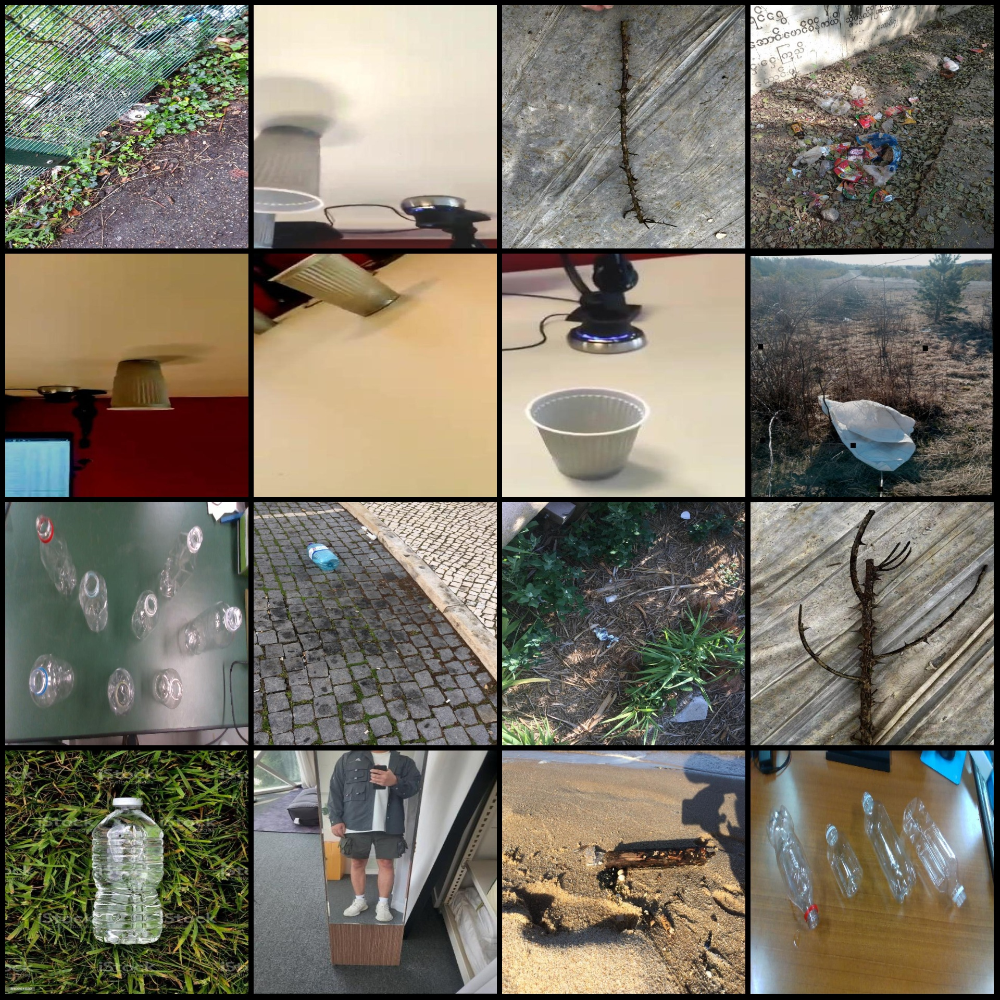
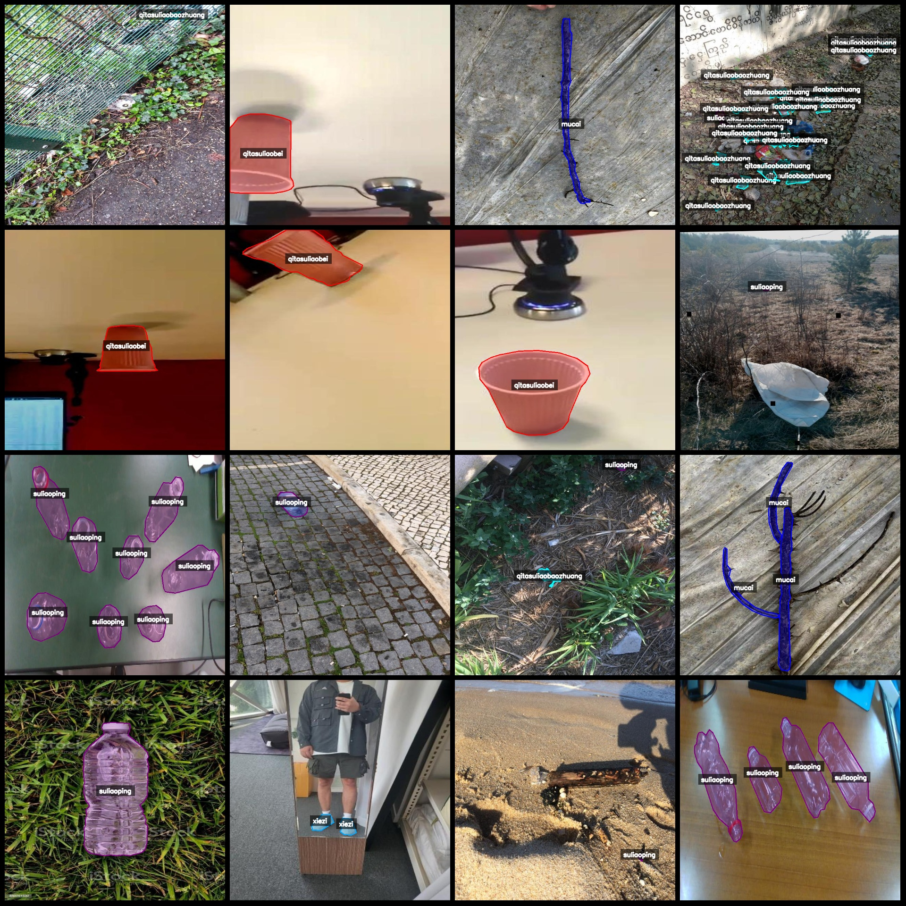
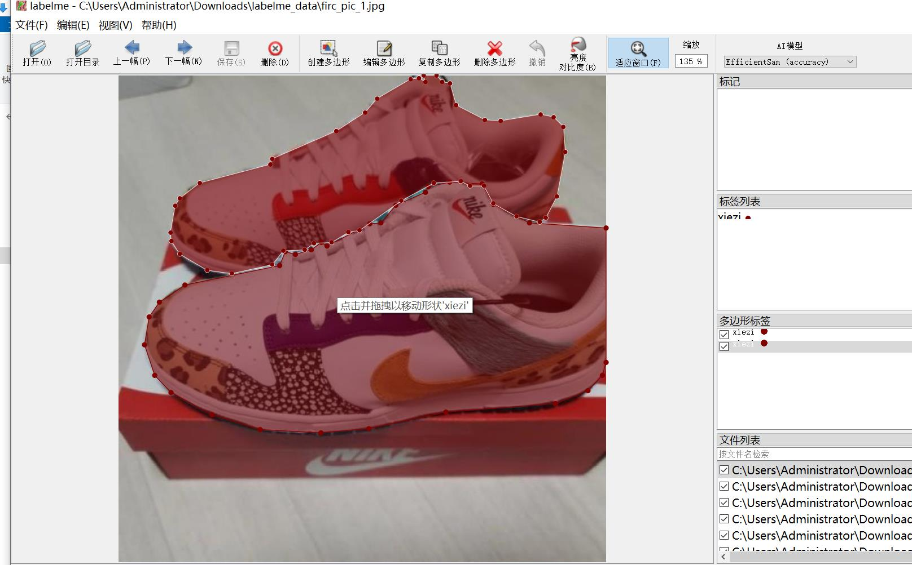

# Waste Sorting and Identification Dataset with LabelME Format

The dataset is in the labelME format (excluding mask files, only including jpg images and corresponding json files).

**Number of Images:** 2240
**Number of Annotations:** 2240
**Number of Categories:** 7
**Category Names:** ["mucai", "paomoshuliaokuai", "qitasuliaobaozhuang", "qitasuliaobei", "shengzixisheng", "suliaoping", "xiezi"]
"Wooden material"

Each category has a specified number of bounding boxes:
- mucai count = 372
- paomoshuliaokuai count = 633
- qitasuliaobaozhuang count = 363
- qitasuliaobei count = 469
- shengzixisheng count = 78
- suliaoping count = 2327
- xiezi count = 444
Total bounding box count = 4686

The annotation tool used is labelME version 5.5.0.
Image resolution: 640x640
Annotation rules: Polygons are drawn around the categories.

Important Notice: The dataset can be edited using labelME, but the json dataset needs to be converted into either mask or YOLOF/COCO format for instance segmentation or semantic segmentation.
Special Notice: This dataset does not guarantee the accuracy of the trained models or weight files.

**Image Preview:**

Example of annotations (picking 16 images):

Annotation drawing results:

LabelME editing example image:
## Images

Here is a pay link on Stripe ( https://buy.stripe.com/3cs8yP7sY87d0vu9AB ). Please contact me lonlonago@foxmail.com after funding $89, and I will send you a complete data files , thank you!

